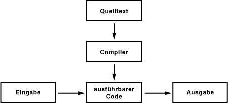
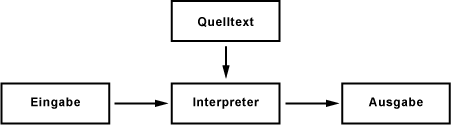

### Compiler, Interpreter, Linker, Make
---
Autor: Philipp Haller, 7AKIF

Datei: [CreationProcess.pdf](./CreationProcess.pdf)

---
#### Compiler

Ein Compiler ist ein Computerprogramm, das den Quellcode einer problemorientierten Programmiersprache  - einer Hochsprache – in ausführbaren Maschinencode übersetzt. Die Rückübersetzung von Maschinensprache in eine bestimmte Programmiersprache wird Dekompilierung genannt. Zielsprache eines Compilers kann auch Assemblersprache sein, welche dann mit Hilfe eines Assemblers in Maschinensprache umgewandelt wird. Im Unterschied zum Interpreter übersetzt der Compiler den kompletten Quellcode mit einem Mal in ausführbaren Code. Das somit erzeugte Programm kann danach beliebig oft ohne erneute Kompilierung gestartet werden. Bei der Ausführung des Programms werden die Anweisungen direkt vom Prozessor verarbeitet. Die Reihenfolge in der die Instruktionen ausgeführt werden, wurde vorher durch den Compiler festgelegt. Müssen Instruktionen nicht aufeinander warten, können diese auch parallel ausgeführt werden. 

 
Der Kompilierungsprozess gliedert sich im Allgemeinen  in die Analysephase (Frontend) sowie die Synthesephase (Backend), welche das Zielprogramm erzeugt. Er setzt sich aus folgenden Vorgängen zusammen.

-	**Syntaxprüfung:**

    Es wird überprüft, ob der Syntax der Quellsprache entspricht, der Quellcode ein ausführbares Programm darstellt und ob Fehler vorhanden sind. Das Ergebnis dieses Vorganges ist eine Zwischendarstellung des Quellcodes.

-	**Analyse und Optimierung:**

    Die Zwischendarstellung wird analysiert und optimiert, wobei Umfang und Qualität der Analyse je nach Compiler stark variieren kann.

-	**Codeerzeugung:**

    Die optimierte Zwischendarstellung wird in ausführbare Befehle der Zielsprache übersetzt.

**Vorteil:**
-	Die Übersetzung in ausführbaren Code ist effizient und führt zu einem optimierten Code. Kompilierte Programme arbeiten sehr schnell, was sich besonders bei größeren Programmen mit langer Laufzeit lohnt.

**Nachteile:**
-	Sobald ein neues Betriebssystem oder ein neuer Prozessor zum Einsatz kommt, muss der Quelltext neu kompiliert werden. In der Praxis verfügen jedoch sowohl Betriebssysteme als auch Prozessoren über einen sogenannten Kompatibilitätsmodus, welcher auch das Ausführen „älterer“ Programme erlaubt.
-	Der Aufwand bei der Software-Entwicklung steigt, da bei jeder Quelltext-Änderung neu kompiliert werden muss, um das Programm zu testen.

#### Interpreter

Bei Interpreter-Sprachen wird der Programmcode während der Laufzeit interpretiert und  umgewandelt.  Sowohl Eingabe als auch Quellcode werden gleichzeitig bearbeitet. Jede Zeile mit einer Instruktion hat eine unmittelbare Aktion des Interpreters zur Folge. Die Arbeitsschritte folgen in logischer Reihenfolge laut Vorgaben des Quellcodes. Der größte Nachteil eines Interpreters ist die geringe Ausführgeschwindigkeit, welche auf die meist direkte Umsetzung des Quellcode in Maschinencode zurückzuführen ist. Eine umfangreiche Codeoptimierung kann während der Laufzeit nicht erfolgen.
 

**Vorteil:**
-	Das Programm kann direkt gestartet werden, ohne dass der Programmcode vom Anwender in irgendeiner Weise verändert oder umgewandelt werden muss.

**Nachteil:**
-	Interpretierte Programme sind langsamer und ineffizienter. Dieselben Programmteile -wie Schleifen und Funktionen-  müssen erneut übersetzt werden.

#### JIT-Compiler

Just in Time Compiler sind eine Kombination aus Compiler und Interpreter. Man kann sich einen JIT-Compiler als eine virtuelle Maschine in Form eines künstlichen Prozessors vorstellen. Der vorliegende Programmcode wird mit Hilfe eines Compilers in einen plattformunabhängigen Bytecode – den Maschinencode des künstlichen Prozessors- umgewandelt. Bei der Ausführung des Programms läuft der virtuelle Prozessor im Hintergrund  und wandelt den Bytecode in die eigentliche Maschinensprache um. Aufgrund der Tatsache, dass die Kompilierung während der Laufzeit durchgeführt wird, ist auch sie in ihrem Umfang beschränkt und konzentriert sich meistens auf die häufig ausgeführten Programmteile, welche einen Großteil der Ausführzeit in Anspruch nehmen.
Bekannte Beispiele sind der JAVA-JIT-Compiler mit dem erzeugten Java-Byte-Code und der JIT- oder NGN-Compiler der .NET Umgebung, welcher den Intermediate-Language Code generiert.

**Vorteile:**
-	Der JIT-Compiler bietet die Möglichkeit den einmal geschriebenen Quelltext auf unterschiedlichen Plattformen einzusetzen, da der künstliche Prozessor für jede geeignete Hardware ausprogrammiert werden kann.
-	Geschwindigkeitssteigerung im Vergleich zu einem Interpreter

#### Beispiele für den Einsatz von  Compiler, Interpreter und JIT-Compiler

Ob ein  Compiler, Interpreter oder JIT-Compiler verwendet wird, richtet sich nach der eingesetzten Hochsprache.

- **Compiler:**	Pascal, Modula, COBOL, Fortran, C, C++, …
- **Interpreter:**	BASIC, Smalltalk, LISP, Phyton, …
- **JIT-Compiler:**	Java, C#, …

#### Linker

Nachdem der Compiler die Dateien in Maschinencode übersetzt hat, fügt der Linker diese Objektdateien zu einem kompletten Programm zusammen. Die kompilierten Module mit Funktionen können in Funktionsbibliotheken (Programmbibliotheken) gespeichert werden. Um ein Programmmodul in einem anderen Programm verwendet zu können, müssen die symbolischen Adressen der Funktionen in Speicheradressen umgewandelt werden.  Der Linker überprüft welche externen Definitionen noch fehlen und durchsucht dabei sowohl die vorliegenden Objekt-Dateien als auch die vorkompilierten Standardbibliotheken. Bei fehlenden Definitionen kommt es zu einem Linker-Fehler. Sind alle Angaben vorhanden, kann aus den kompilierten Teilen und den benötigten Bibliotheken eine einzige Datei erstellt, welche das lauffähige Programm darstellt.

#### Make

Make ist ein Build-Management Tool für Projekte, in denen der Quellcode in verschiedenen Dateien vorliegt. Hierbei steuert das Tool automatisiert alle Arbeitsschritte (Übersetzten, Linken, Dateien kopieren etc.) bis ein fertig, ausführbares Programm vorliegt. Das resultierende Makefile erfasst alle Abhängigkeiten im Übersetzungsprozess und beschreibt somit welche Quelltextdateien durch den Compiler zu welchen Objektdateien verarbeitet werden und welche Objektdateien durch den Linker zu Programmbibliotheken oder anderen ausführbaren Programmen verbunden werden. Vor allem bei großen Programmpaketen müssen somit bei kleinen Änderungen nicht alle Teile neu kompiliert werden.

