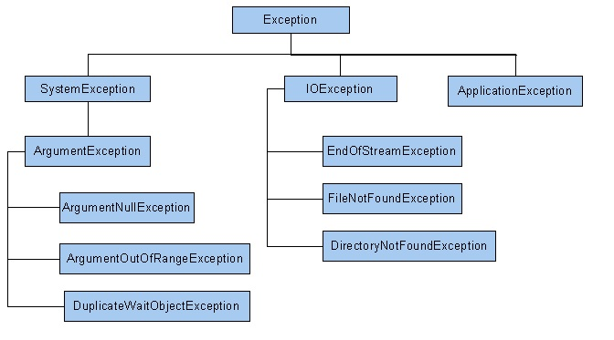

### Exceptions
---
Autor: Philipp Haller, 7AKIF

Datei: [ExceptionHandling.pdf](./ExceptionHandling.pdf)

---
Als Exception wird eine Ausnahme bzw. Ausnahmesituation bezeichnet, welche in der Regel auf einen Fehlerzustand hinweist. Diese Ausnahmesituationen werden nach Ihrer Diagnose an andere Programmebenen weitergereicht, um dort abgearbeitet zu werden. Als Exception Handler wird der Code bezeichnet, mit welchem die Exception behandelt wird. Grundsätzlich werden folgende zwei Arten von Ausnahmen unterschieden.
- **Implizite Ausnahmen:**	Werden von  der Common Language Runtime durch ungültige Operationen ausgelöst (z.B. Division durch 0, Indexüberschreitung beim Zugriff auf eine Array-Element, Zugriff auf eine null-Referenz,…)
- **Explizite Ausnahmen:**	Werden vom Programmierer mit Hilfe einer throw-Anweisung ausgelöst

#### Die Exception Class im Namespace System
Sie enthält alle Ausnahmen, welche sich von der Basisklasse Exception ableiten und ist hierarchisch aufgebaut. In der zweiten Ebene kommt es zu einer Kategorisierung der abgeleiteten Ausnahmen in SystemExecptions, IOExceptions und ApplicationsExceptions, welche wiederum die Oberklassen für weitere Exceptions darstellen.

 
Selbstverständlich ist es dem Programmierer auch möglich, eigene Ausnahmeklassen zu definieren, welche Unterklassen der ApplicationException Klasse darstellen sollten.

#### Auslösen und Behandeln von Exceptions
Im try-Block werden Anweisungen bzw. Methoden ausgeführt, welche möglicherweise Exceptions auslösen können. Für das Abfangen der Exceptions dient der catch-Block. Es besteht die Möglichkeit sowohl alle Exceptions abzufangen als auch die Auswahl auf bestimmte Ausnahmetypen einzuschränken. Neben der Behandlung von Exceptions können über den catch-Block Exceptions auch mit Hilfe einer InnerException ineinander verschachtelt und erneut geworfen werden, um an anderer Stelle behandelt zu werden. Wird der try-Block ausgeführt, so wird auch der optionale finally-Block erledigt.  Er eignet sich daher zur Freigabe von Ressourcen, um beispielsweise Streams oder Dateien zu schließen, die im try-Block geöffnet wurden. Aufgrund der Verknüpfung von try- und finally Block kann es nicht dazu kommen, dass eine Ressource nicht freigegeben wird, wenn es zu einer unvorhergesehenen Exception kommt. Das angeführte Codebeispiel veranschaulicht die Funtionsweise der drei Blöcke.

    public class EHClass
    {
        void ReadFile(int index)
        {
            // To run this code, substitute a valid path from your local machine
            string path = @"c:\users\public\test.txt";
            System.IO.StreamReader file = new System.IO.StreamReader(path);
            char[] buffer = new char[10];
            try
            {
                file.ReadBlock(buffer, index, buffer.Length);
            }
            catch (System.IO.IOException e)
            {
                Console.WriteLine("Error reading from {0}. Message = {1}", path, e.Message);
            }
            
            finally
            {
                if (file != null)
                {
                    file.Close();
                }
            }
            // Do something with buffer...
        }
    }

#### Wichtige Properties und Methoden
- **e.Message:**	Zeigt die entsprechende Fehlermeldung an
- **e.Source:**	Liefert den Namen des Programms (d.h. des Assemblies) in dem die Ausnahme auftrat. 
- **e.TargetSize:**	Liefert Informationen über die Methode in welcher der Fehler auftrat
- **e.StackTrace:**	Liefert die Prozeduraufrufkette bis hin zur Main-Methode
- **e.InnerException:**	Liefert die Gruppe von Ausnahmen, die zur aktuellen Ausnahme geführt hat
- **e.ToString():**	Zeigt Namen der Ausnahmeklasse als auch die Werte von e.Message und e.StackTrace

#### Unterschied gegenüber der Fehlerbehandlung mit Rückgabewert
Der Einsatz von Exceptions ermöglicht eine strukturierte Ausnahmebehandlung, bei welcher der Code zur Ausnahmebehandlung vom fehlerverursachenden Code getrennt ist. Anstatt bei jedem Funktionsaufruf einen Rückgabewert zu prüfen, welcher in seinem Informationsgehalt reduziert ist und daher vom Programmierer entsprechend interpretiert werden muss, kann eine Exception ausgelöst werden, welche alle für die Problemerkennung und –behandlung notwendigen Informationen enthält. Die Ausnahme wird solange an aufrufende Funktionen weitergegeben bis sie schließlich abgefangen und sinnvoll behandelt wird. Kommt es zu keiner Behandlung beendet die Common Language Runtime den Prozess und zeigt eine Meldung für den Benutzer an.

**Vorteile Fehlerbehandlung mit Rückgabewert:**
-  Fehler werden dort behandelt, wo sie aufgetreten sind

**Nachteile Fehlerbehandlung mit Rückgabewert:**
-  Fehler werden dort behandelt, wo sie aufge*
-	Aufwändig: vor lauter Fehlerbehandlung sieht man das eigentliches Programm nicht mehr 
-	Abfragen des Fehlercodes kann vergessen werden 
-	Abfragen des Fehlercodes wird oft aus Bequemlichkeit nicht durchgeführt 
-	Methoden können in der Regel neben Fehlercode kein anderes Ergebnis mehr liefern

**Vorteile Exceptions:**
- Enhalten umfangreiche Informationen zu den ausgelösten Ausnahmezuständen
- Können an aufrufende Funktionen weitergereicht werden, um dort behandelt zu  werden
- Sind in der Exception Klasse hierachisch gegliedert und individuell erweiterbar
-  Für den Programmierer ist es (fast) unmöglich, eine aufgetretene Exception zu ignorieren

**Nachteile Exceptions:**
- Oftmals wird die eigentliche Fehlerursache nicht mehr behoben, sondern nur mehr die aufgetretene Ausnahme behandelt
