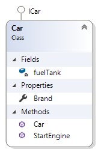
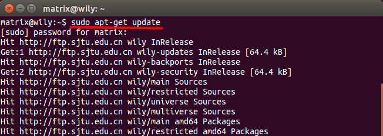

## Terms
### Ordnen Sie die nachfolgenden Begriffe nach ihrer Entstehung und erläutern Sie die Bedeutung:
**Verantwortlicher:** Engleder Michael

- Bibliothek
- Unterprogramm
- Prozedur
- Klasse
- Funktion
- Package
- Modul

-------------------------------------
#### Anfänge der Programmierung
Am Anfang wurde sämtlicher Code in einem File (Anmerkung: "Spaghetti-Code") geschrieben.  In Skript-Sprachen wie CMD, PowerShell findet man oft heute noch diesen Ansatz vor!  

#### Unterprogramme
Unterprogramme oder in C# Methoden sind Codeblöcke mit Anweisungen. 
Ein Programm ruft ein Unterprogramme auf und alle Anweisungen innerhalb dieser Metoden werden ausgeführt!   Diesen Ansatz nennt man prozedurale Programmierung und ebnete den Weg weg von Assemblersprachen hin zu höheren Sprachen.
Dabei können Unterprogramme sowohl Werte zurückgeben, oder Werte als Parameter vom Aufrufer erhalten.
Weiter können Methoden mit unterschiedlichen Zugriffsmodifikatoren (**private/public**) versehen werden. 
Siehe Prozedur / Funktion

#### Prozedur
Prozeduren sind Unterprogramme und werden von einem Programm aufgerufen, geben aber **keinen Wert (void)** zurück  
````
    class Program
    {
        static void Main(string[] args)
        {
            WriteHelloWorld
        }
        public static void WriteHelloWorld()
        {
            Console.WriteLine("Hello World!");
        }
    }
````

#### Funktion
Funktionen sind Unterprogramme, werden von einem Programm aufgerufen und geben **einen Wert** zurück.  
````
    class Program
    {
        static void Main(string[] args)
        {
            int sum = Sum(1, 2);
        }

        private static int Sum(int num1, int num2)
        {
            return num1 + num2;
        }
    }
````
#### Modul
Unterprogramme werden in einer logischen Einheiten (Z.B eigene Datei) zusammengefasst! Die Unterprogramme eines Moduls können dann von einem Program aufgerufen werden. Module können einzeln geplant, programmiert und getestet werden.  Zusätzlich wird durch die Aufteilung auch die Lesbarkeit des Codes verbessert.
#### Klassen
Klassen beschreiben **Eigenschaften und Fähigkeiten** von Objekten. (= objektorierntierte Programmierung)  
Klassen werden in C# mit **class** deklariert und können mit unterschiedlichen Zugriffsmodifikatoren (**private/public**) versehen werden. 
Diese können Fields, Properties und Methoden als sogenannte Members beinhalten.
Klassen können von anderen Klassen oder Interfaces deren Members erben. (**Vererbung**)  
Instanziert werden Klassen mit dem Schlüsselwort new(). Dabei wird der Konstruktor aufgerufen, welchen auch Parameter zur Instanzierung übergeben werden können.  

````
    public class Car
    {
        private int fuelTank;
        public string Brand { get; set; }
        public Car(int maxFuelLevel)
        {
            this.fuelTank = maxFuelLevel;
        }
        public void StartEngine()
        {

        }
    }
````
Abbildung Klassendiagramm  


#### Bibliothek
Bibliotheken sind Sammlungen von Modulen und Klassen und deren Unterprogramme. Diese können von einem Programmen angefordert werden.
Im Unterschied zu Programmen stellen Bibliotheken keine eigenen lauffähigen Einheiten dar!
Nach der Kompilierung werden Bibliotheken unter .net in DLL-Dateien (Assembly) übersetzt!

#### Package
Ein Package kann neben dem eigentlichen ausführbaren Programm auch andere Programme und Dateien enthalten. Packages können z.B. einfache Archive (z.B. TAR-Packages unter Linux) darstellen und diese werden dann von einem Package-Manager angefordert. 

````
sudo apt-get update
# Aktualisiert die Package Datenbank unter der jeweiligen Linux Distribution
```` 
Abbildung PackageManager Linux  

